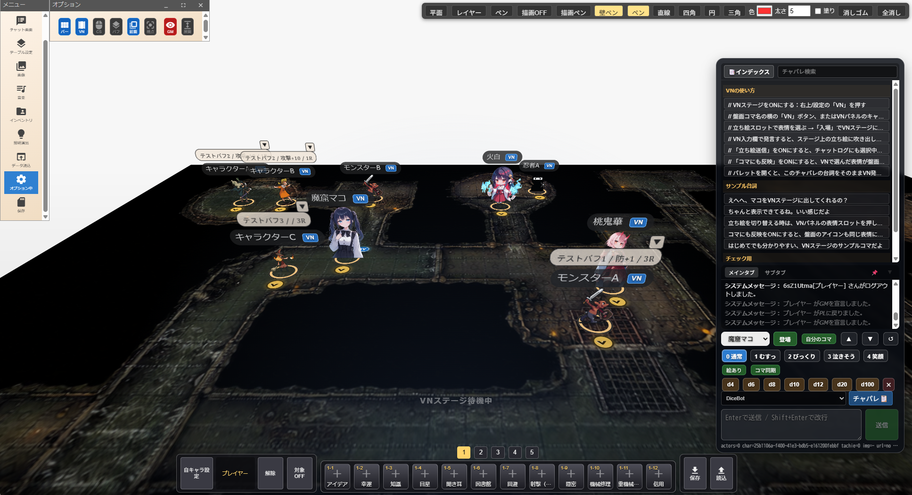
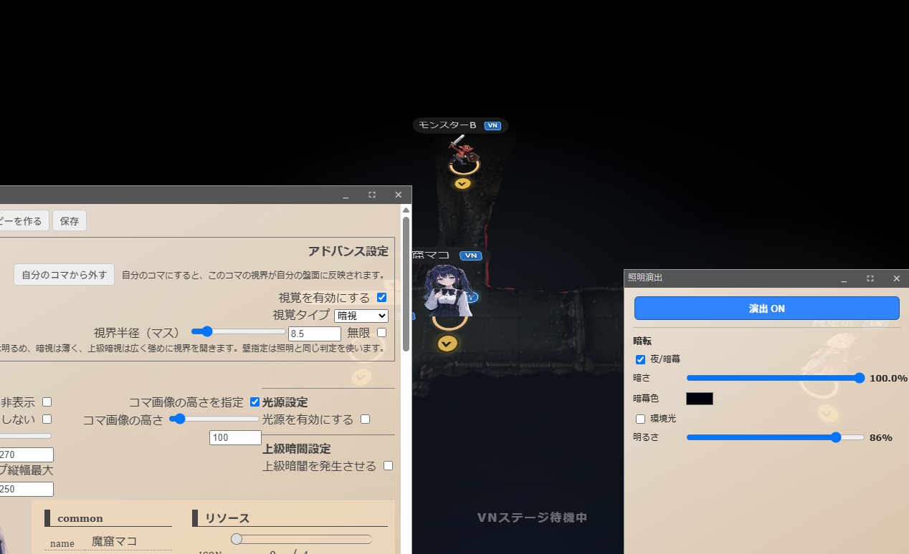
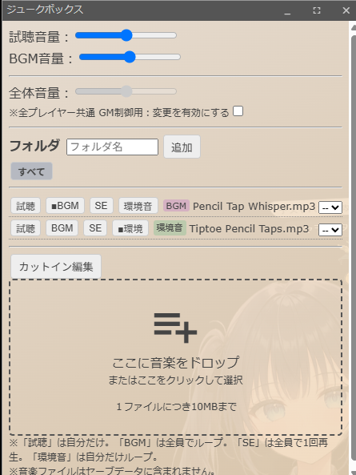
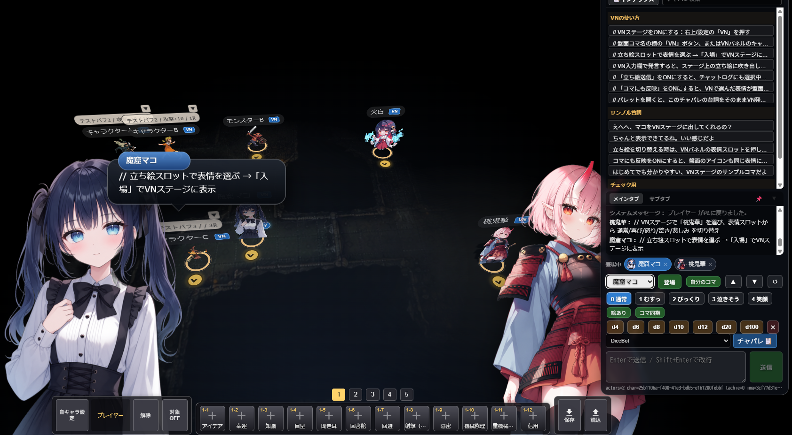
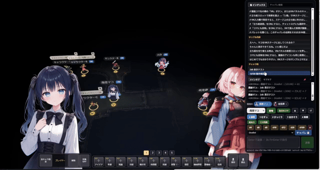

<div align="center">


# 🌸 ユドナリウムリコリス

**Udonarium Lycoris** — ブラウザだけで、どこでもTRPGを。

[](https://github.com/oron1208/udonarium-lycoris/blob/main/LICENSE)
[](https://github.com/oron1208/udonarium-lycoris/releases)
[](https://angular.io/)

### [▶ 今すぐ使う](https://udonarium-lycoris.ddns.net) · [📖 取り扱い説明書](https://udonarium-lycoris.ddns.net/docs/) · [💾 ダウンロード](https://github.com/oron1208/udonarium-lycoris/releases)

---



</div>

## ✨ リコリスとは

ユドナリウムリコリスは、[ユドナリウムリリィ（Cylinder Lily）](https://cylinder-lily.com) をベースに、**TRPGのオンラインセッションをもっと楽しく** をテーマに大幅な改修を加えたフォーク版です。

原作者 [TK11235](https://github.com/TK11235/udonarium) とリリィ開発者の素晴らしい成果物に深く感謝します。

### 🔴 リコリス独自機能

| 機能 | 説明 |
|------|------|
| 🕯️ **照明エンジン** | 松明・魔法の光・懐中電灯・レーザー。壁による光遮断もレイキャストで再現 |
| 🎵 **ジュークボックス** | BGM・SE・環境音の3モード。ワンクリックで雰囲気をチェンジ |
| 🎭 **VNモード** | ビジュアルノベル風の立ち絵表示。表情切り替えでシーンを彩る |
| 🎲 **ダイスカットイン** | ダイスロール時の演出アニメーション |
| 🧭 **コマ演出** | 正面マーク表示・回転操作・高度な部屋設定 |
| 👁️ **視線・所有権** | ピースごとの所有権設定と視線管理 |
| 📝 **更新ノート** | バージョン更新内容をアプリ内で確認可能 |

---

## 📸 スクリーンショット

<!-- TODO: 以下の画像を実際のスクショに差し替えてください -->

<table>
<tr>
<td align="center" width="50%">

<!-- TODO: 照明システムのスクショ -->
**🕯️ 照明システム**

<em>松明・レーザー・壁の光遮断</em>

</td>
<td align="center" width="50%">

<!-- TODO: ジュークボックスのスクショ -->
**🎵 ジュークボックス**

<em>BGM / SE / 環境音の3モード</em>

</td>
</tr>
<tr>
<td align="center" width="50%">

<!-- TODO: VNモードのスクショ -->
**🎭 VNモード**

<em>ビジュアルノベル風の立ち絵表示</em>

</td>
<td align="center" width="50%">

<!-- TODO: ダイスカットインのGIF -->
**🎲 ダイスカットイン**
<!--  -->
<em>ダイスロール演出</em>

</td>
</tr>
</table>

---

## 🚀 使い方

### すぐ遊ぶ（公開サーバー）

ブラウザでアクセスするだけ。アカウント登録不要。

👉 **[https://udonarium-lycoris.ddns.net](https://udonarium-lycoris.ddns.net)**

### 自前サーバーに設置する

1. [Releases](https://github.com/oron1208/udonarium-lycoris/releases) から最新版をダウンロード
2. Webサーバーに配置して `index.html` にアクセス
3. [SkyWay](https://webrtc.ecl.ntt.com/) のAPIキーを取得し、`src/assets/config.yaml` に設定

詳細は [📖 取り扱い説明書](https://udonarium-lycoris.ddns.net/docs/) をご覧ください。

### Docker で立てる

```bash
docker run -d \
  --name udonarium-lycoris \
  -p 12081:12081 \
  --env-file /path/to/env \
  ghcr.io/oron1208/udonarium-lycoris:latest
```

---

## 🏗️ ビルド（開発者向け）

```bash
# 依存インストール
npm install

# 開発サーバー起動
ng serve

# プロダクションビルド
ng build --prod
```

> ビルドには `--prod` フラグが必須です（3rdpartylicenses.txt の自動生成のため）。

---

## 🌸 名前の由来

**リコリス（Lycoris）** — 彼岸花の英名。

「あの世とこの世の境界に咲く花」のように、TRPGという虚構と現実の境界で、プレイヤーたちに忘れられない体験を咲かせたい。そんな想いを込めて。

---

## 📜 クレジット

| 役割 | リンク |
|------|--------|
| **製作者** | [おれおん（@oron1208）](https://x.com/oron1208) |
| **ベースフォーク** | [ユドナリウムリリィ（Cylinder Lily）](https://cylinder-lily.com) |
| **オリジナル** | [ユドナリウム（TK11235）](https://github.com/TK11235/udonarium) |

## 📄 ライセンス

[MIT License](LICENSE) — オリジナルのユドナリウムのライセンスを引き継ぎます。

---

<div align="center">

**彼岸花の咲く場所で、最高のTRPGセッションを。🌸**

</div>
